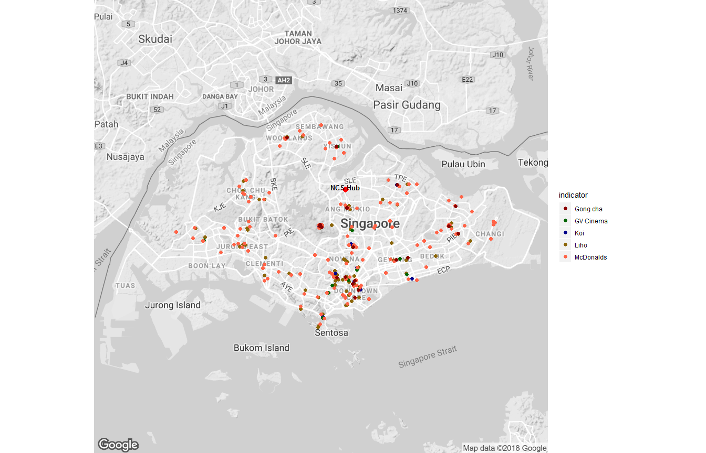

<style type="text/css">
.main-container{
  max-width: 1300px;
  margin-left: auto;
  margin-right: auto;
}
body, td{
  font-family: Helvetica;
  font-size: 16pt;
}
pre{ 
  font-size: 14px; 
}
pre.r{ 
  font-size: 14px;
}
</style>


<br/>

**References**

* https://github.com/jaredgoh/Project-Work/tree/master/.mini%20guides/Web%20Scraping

***
<br />

## Getting the Data 

We first create our index which holds the relevant locations and the urls we plan on scraping.


```r
# reading required variables 
# either have a valid google api key for geocoding api or have "lat_long_data.csv" in your working directory
creds = read_json(paste(path.expand('~'),'/creds.json', sep = ''))
google_apikey = creds$Google_api$geocode_api
register_google(key = google_apikey)

rm(creds)


# setting the reference index
locations <- c("Liho", "Koi", "GV Cinema", "McDonalds", "Gong cha")
urls <- c("https://www.streetdirectory.com/businessfinder/company_branch/163304/5890/",
          "https://www.streetdirectory.com/businessfinder/company_branch/109085/168981/",
          "https://www.streetdirectory.com/businessfinder/company_branch/36232/30314/",
          "https://www.streetdirectory.com/businessfinder/company_branch/65869/254129/",
          "https://www.gong-cha-sg.com/stores/")
          
index <- data.frame(locations, urls, stringsAsFactors = FALSE) 
kable(index) %>% kable_styling()
```

<table class="table" style="margin-left: auto; margin-right: auto;">
 <thead>
  <tr>
   <th style="text-align:left;"> locations </th>
   <th style="text-align:left;"> urls </th>
  </tr>
 </thead>
<tbody>
  <tr>
   <td style="text-align:left;"> Liho </td>
   <td style="text-align:left;"> https://www.streetdirectory.com/businessfinder/company_branch/163304/5890/ </td>
  </tr>
  <tr>
   <td style="text-align:left;"> Koi </td>
   <td style="text-align:left;"> https://www.streetdirectory.com/businessfinder/company_branch/109085/168981/ </td>
  </tr>
  <tr>
   <td style="text-align:left;"> GV Cinema </td>
   <td style="text-align:left;"> https://www.streetdirectory.com/businessfinder/company_branch/36232/30314/ </td>
  </tr>
  <tr>
   <td style="text-align:left;"> McDonalds </td>
   <td style="text-align:left;"> https://www.streetdirectory.com/businessfinder/company_branch/65869/254129/ </td>
  </tr>
  <tr>
   <td style="text-align:left;"> Gong cha </td>
   <td style="text-align:left;"> https://www.gong-cha-sg.com/stores/ </td>
  </tr>
</tbody>
</table>

<br />

We then define the relevant functions we plan on using to get the data needed. Note the created function already alters the output into the format that we want. 


```r
# function used to scrape data 
getting_data <- function(url_link, css_selector) {
  url_link %>%
    read_html() %>%
    html_nodes(css_selector) %>%
    html_text() %>%
    str_replace_all(.,"\\r|\\n","") %>%
    str_trim() %>%
    str_replace_all(.,"  ","")
}


# reading data for Liho, Koi, GV Cinema and McDonalds
basedata <-
  map(seq_along(index$urls[1:4]), function(x) {
    data.frame(name = getting_data(index$urls[x], ".company_branch_name"),
               address = getting_data(index$urls[x], ".company_branch_address"),
               postcode = str_extract(getting_data(index$urls[x], ".company_branch_address"), "[0-9]{6}$"),
               indicator = index$locations[x], 
               stringsAsFactors = FALSE)
    }) %>%
  setNames(index$locations[1:4])


# reading Gong cha data
# this is different as the Gong cha website loads using javascript
# I found no elegant way to read the data directly from R so defaulted to the easiest method
if(!file.exists("gong_cha.html")) {
warning("You need to save http://www.gong-cha-sg.com/stores/ into working directory as 'gong_cha.html'")
  
  } else {
    gong_cha_data <-
      data.frame(name = getting_data("gong_cha.html", ".p-title"),
                 address = getting_data("gong_cha.html", ".p-area"),
                 postcode = str_extract(getting_data("gong_cha.html", ".p-area"), "[0-9]{6}$"),
                 indicator = index$locations[5],
                 stringsAsFactors = FALSE)
    
    basedata$`Gong cha` <- gong_cha_data
}

location_data <-
  bind_rows(basedata)


# check if there are any rows with postalcode not equal to 6 digits
location_data %>% mutate(count_postal = nchar(postcode)) %>% filter(count_postal != 6)
```

```
## [1] name         address      postcode     indicator    count_postal
## <0 rows> (or 0-length row.names)
```

```r
# table output 
kable(location_data %>% group_by(indicator) %>% slice(1:3)) %>% kable_styling()
```

<table class="table" style="margin-left: auto; margin-right: auto;">
 <thead>
  <tr>
   <th style="text-align:left;"> name </th>
   <th style="text-align:left;"> address </th>
   <th style="text-align:left;"> postcode </th>
   <th style="text-align:left;"> indicator </th>
  </tr>
 </thead>
<tbody>
  <tr>
   <td style="text-align:left;"> 1 Raffles Place (1RP) </td>
   <td style="text-align:left;"> 1 Raffles Place#B1-39, Shopping Podium Tower 1, Singapore 048616 </td>
   <td style="text-align:left;"> 048616 </td>
   <td style="text-align:left;"> Gong cha </td>
  </tr>
  <tr>
   <td style="text-align:left;"> Ang Mo Kio (AMK) </td>
   <td style="text-align:left;"> 703 Ang Mo Kio Ave 3#01-2531, Singapore 560703 </td>
   <td style="text-align:left;"> 560703 </td>
   <td style="text-align:left;"> Gong cha </td>
  </tr>
  <tr>
   <td style="text-align:left;"> Bugis Junction (BJ) </td>
   <td style="text-align:left;"> Bugis Junction#03-08, The Victoria Street , Singapore 188021 </td>
   <td style="text-align:left;"> 188021 </td>
   <td style="text-align:left;"> Gong cha </td>
  </tr>
  <tr>
   <td style="text-align:left;"> Golden Village Multiplex Pte Ltd </td>
   <td style="text-align:left;"> Plaza Singapura #07-01,68 Orchard Road, 238839 </td>
   <td style="text-align:left;"> 238839 </td>
   <td style="text-align:left;"> GV Cinema </td>
  </tr>
  <tr>
   <td style="text-align:left;"> Golden Village Cinema, Marina Square </td>
   <td style="text-align:left;"> Marina Square #03-01,6 Raffles Boulevard, 039594 </td>
   <td style="text-align:left;"> 039594 </td>
   <td style="text-align:left;"> GV Cinema </td>
  </tr>
  <tr>
   <td style="text-align:left;"> Golden Village Cinema, Tiong Bahru Plaza </td>
   <td style="text-align:left;"> Tiong Bahru Plaza #04-03/04,302 Tiong Bahru Road, 168732 </td>
   <td style="text-align:left;"> 168732 </td>
   <td style="text-align:left;"> GV Cinema </td>
  </tr>
  <tr>
   <td style="text-align:left;"> Koi Cafe Group (S) Pte Ltd HDB Marine Parade Promenade </td>
   <td style="text-align:left;"> HDB Marine Parade Promenade #01-562,83 Marine Parade Central, 440083 </td>
   <td style="text-align:left;"> 440083 </td>
   <td style="text-align:left;"> Koi </td>
  </tr>
  <tr>
   <td style="text-align:left;"> Koi Cafe Millenia Walk </td>
   <td style="text-align:left;"> Millenia Walk #01-K12/K13,9 Raffles Boulevard, 039596 </td>
   <td style="text-align:left;"> 039596 </td>
   <td style="text-align:left;"> Koi </td>
  </tr>
  <tr>
   <td style="text-align:left;"> Koi Cafe Toa Payoh Central </td>
   <td style="text-align:left;"> #01-562,190A Toa Payoh Central, 319196 </td>
   <td style="text-align:left;"> 319196 </td>
   <td style="text-align:left;"> Koi </td>
  </tr>
  <tr>
   <td style="text-align:left;"> LiHO @ City Square Mall </td>
   <td style="text-align:left;"> City Square Mall #B2-K3/K4,180 Kitchener Road, 208539 </td>
   <td style="text-align:left;"> 208539 </td>
   <td style="text-align:left;"> Liho </td>
  </tr>
  <tr>
   <td style="text-align:left;"> LiHO @ Tanjong Pagar MRT Xchange </td>
   <td style="text-align:left;"> Tanjong Pagar MRT Station (EW15) #B1-08,120 Maxwell Road, 069119 </td>
   <td style="text-align:left;"> 069119 </td>
   <td style="text-align:left;"> Liho </td>
  </tr>
  <tr>
   <td style="text-align:left;"> LiHO @ 100 AM </td>
   <td style="text-align:left;"> 100 AM #02-25,100 Tras Street, 079027 </td>
   <td style="text-align:left;"> 079027 </td>
   <td style="text-align:left;"> Liho </td>
  </tr>
  <tr>
   <td style="text-align:left;"> McDonald's *SCAPE Park </td>
   <td style="text-align:left;"> *SCAPE #02-43,2 Orchard Link, 237978 </td>
   <td style="text-align:left;"> 237978 </td>
   <td style="text-align:left;"> McDonalds </td>
  </tr>
  <tr>
   <td style="text-align:left;"> McDonald's Marina Square </td>
   <td style="text-align:left;"> Marina Square #02-156/157/166 ,6 Raffles Boulevard, 039594 </td>
   <td style="text-align:left;"> 039594 </td>
   <td style="text-align:left;"> McDonalds </td>
  </tr>
  <tr>
   <td style="text-align:left;"> McDonald's Boat Quay </td>
   <td style="text-align:left;"> 1 South Canal Road, 048508 </td>
   <td style="text-align:left;"> 048508 </td>
   <td style="text-align:left;"> McDonalds </td>
  </tr>
</tbody>
</table>

<br />

We next use the google maps geocode api [Google maps gecoding intro](https://developers.google.com/maps/documentation/geocoding/intro) to get the relevant latitudes and longitudes. To do this you need to have a valid api key. If you do not have one, fret not. I have already pre-saved the geocode information before hand. Just make sure you have the reference csv "lat_long_data_with_errors" in your working enviroment. 


```r
# function used to call the api
calling_google_geocode <- function(postcode, apikey) {

  output <-
    "https://maps.googleapis.com/maps/api/geocode/json?address=Singapore+xxpostcodexx&key=xxapikeyxx" %>%
    str_replace_all(c('xxpostcodexx' = postcode, 'xxapikeyxx' = apikey)) %>%
    fromJSON()
  
  
  if(length(output) == 0) return(data.frame())
  return(output$results$geometry$location)
}


# getting latitudes and longitudes
if(!file.exists("lat_long_data_with_errors.csv")) {
  
  lat_long_data <-
  location_data %>%
  .$postcode %>%
  map(., function(i) {
    output_api <- calling_google_geocode(postcode = i, apikey = google_apikey)
    return(data.frame(postcode_used = i, output_api, stringsAsFactors = FALSE))
    
  }) %>%
  bind_rows() %>%
  bind_cols(location_data, .)
  
  # saving data cause I am cheap and google apis can actually charge you now
  lat_long_data %>% write_csv("lat_long_data_with_errors.csv")
  
  } else {
  
  lat_long_data <- read_csv("lat_long_data_with_errors.csv")
  
  }
```

```
## Parsed with column specification:
## cols(
##   name = col_character(),
##   address = col_character(),
##   postcode = col_character(),
##   indicator = col_character(),
##   postcode_used = col_character(),
##   lat = col_double(),
##   lng = col_double()
## )
```

```r
# table output 
kable(lat_long_data %>% select(-postcode_used) %>% group_by(indicator) %>% slice(1:3)) %>% kable_styling()
```

<table class="table" style="margin-left: auto; margin-right: auto;">
 <thead>
  <tr>
   <th style="text-align:left;"> name </th>
   <th style="text-align:left;"> address </th>
   <th style="text-align:left;"> postcode </th>
   <th style="text-align:left;"> indicator </th>
   <th style="text-align:right;"> lat </th>
   <th style="text-align:right;"> lng </th>
  </tr>
 </thead>
<tbody>
  <tr>
   <td style="text-align:left;"> 1 Raffles Place (1RP) </td>
   <td style="text-align:left;"> 1 Raffles Place#B1-39, Shopping Podium Tower 1, Singapore 048616 </td>
   <td style="text-align:left;"> 048616 </td>
   <td style="text-align:left;"> Gong cha </td>
   <td style="text-align:right;"> 1.2844790 </td>
   <td style="text-align:right;"> 103.851082 </td>
  </tr>
  <tr>
   <td style="text-align:left;"> Ang Mo Kio (AMK) </td>
   <td style="text-align:left;"> 703 Ang Mo Kio Ave 3#01-2531, Singapore 560703 </td>
   <td style="text-align:left;"> 560703 </td>
   <td style="text-align:left;"> Gong cha </td>
   <td style="text-align:right;"> 1.3699980 </td>
   <td style="text-align:right;"> 103.847311 </td>
  </tr>
  <tr>
   <td style="text-align:left;"> Bugis Junction (BJ) </td>
   <td style="text-align:left;"> Bugis Junction#03-08, The Victoria Street , Singapore 188021 </td>
   <td style="text-align:left;"> 188021 </td>
   <td style="text-align:left;"> Gong cha </td>
   <td style="text-align:right;"> 1.2993690 </td>
   <td style="text-align:right;"> 103.854921 </td>
  </tr>
  <tr>
   <td style="text-align:left;"> Golden Village Multiplex Pte Ltd </td>
   <td style="text-align:left;"> Plaza Singapura #07-01,68 Orchard Road, 238839 </td>
   <td style="text-align:left;"> 238839 </td>
   <td style="text-align:left;"> GV Cinema </td>
   <td style="text-align:right;"> 1.3010160 </td>
   <td style="text-align:right;"> 103.845411 </td>
  </tr>
  <tr>
   <td style="text-align:left;"> Golden Village Cinema, Marina Square </td>
   <td style="text-align:left;"> Marina Square #03-01,6 Raffles Boulevard, 039594 </td>
   <td style="text-align:left;"> 039594 </td>
   <td style="text-align:left;"> GV Cinema </td>
   <td style="text-align:right;"> 1.2909890 </td>
   <td style="text-align:right;"> 103.857422 </td>
  </tr>
  <tr>
   <td style="text-align:left;"> Golden Village Cinema, Tiong Bahru Plaza </td>
   <td style="text-align:left;"> Tiong Bahru Plaza #04-03/04,302 Tiong Bahru Road, 168732 </td>
   <td style="text-align:left;"> 168732 </td>
   <td style="text-align:left;"> GV Cinema </td>
   <td style="text-align:right;"> 1.2861450 </td>
   <td style="text-align:right;"> 103.827342 </td>
  </tr>
  <tr>
   <td style="text-align:left;"> Koi Cafe Group (S) Pte Ltd HDB Marine Parade Promenade </td>
   <td style="text-align:left;"> HDB Marine Parade Promenade #01-562,83 Marine Parade Central, 440083 </td>
   <td style="text-align:left;"> 440083 </td>
   <td style="text-align:left;"> Koi </td>
   <td style="text-align:right;"> 1.3017690 </td>
   <td style="text-align:right;"> 103.906719 </td>
  </tr>
  <tr>
   <td style="text-align:left;"> Koi Cafe Millenia Walk </td>
   <td style="text-align:left;"> Millenia Walk #01-K12/K13,9 Raffles Boulevard, 039596 </td>
   <td style="text-align:left;"> 039596 </td>
   <td style="text-align:left;"> Koi </td>
   <td style="text-align:right;"> 1.2916010 </td>
   <td style="text-align:right;"> 103.860166 </td>
  </tr>
  <tr>
   <td style="text-align:left;"> Koi Cafe Toa Payoh Central </td>
   <td style="text-align:left;"> #01-562,190A Toa Payoh Central, 319196 </td>
   <td style="text-align:left;"> 319196 </td>
   <td style="text-align:left;"> Koi </td>
   <td style="text-align:right;"> 1.3331420 </td>
   <td style="text-align:right;"> 103.849610 </td>
  </tr>
  <tr>
   <td style="text-align:left;"> LiHO @ City Square Mall </td>
   <td style="text-align:left;"> City Square Mall #B2-K3/K4,180 Kitchener Road, 208539 </td>
   <td style="text-align:left;"> 208539 </td>
   <td style="text-align:left;"> Liho </td>
   <td style="text-align:right;"> 1.3114030 </td>
   <td style="text-align:right;"> 103.856620 </td>
  </tr>
  <tr>
   <td style="text-align:left;"> LiHO @ Tanjong Pagar MRT Xchange </td>
   <td style="text-align:left;"> Tanjong Pagar MRT Station (EW15) #B1-08,120 Maxwell Road, 069119 </td>
   <td style="text-align:left;"> 069119 </td>
   <td style="text-align:left;"> Liho </td>
   <td style="text-align:right;"> 1.2766910 </td>
   <td style="text-align:right;"> 103.845401 </td>
  </tr>
  <tr>
   <td style="text-align:left;"> LiHO @ 100 AM </td>
   <td style="text-align:left;"> 100 AM #02-25,100 Tras Street, 079027 </td>
   <td style="text-align:left;"> 079027 </td>
   <td style="text-align:left;"> Liho </td>
   <td style="text-align:right;"> 1.2749290 </td>
   <td style="text-align:right;"> 103.843549 </td>
  </tr>
  <tr>
   <td style="text-align:left;"> McDonald's *SCAPE Park </td>
   <td style="text-align:left;"> *SCAPE #02-43,2 Orchard Link, 237978 </td>
   <td style="text-align:left;"> 237978 </td>
   <td style="text-align:left;"> McDonalds </td>
   <td style="text-align:right;"> 1.3010489 </td>
   <td style="text-align:right;"> 103.835327 </td>
  </tr>
  <tr>
   <td style="text-align:left;"> McDonald's Marina Square </td>
   <td style="text-align:left;"> Marina Square #02-156/157/166 ,6 Raffles Boulevard, 039594 </td>
   <td style="text-align:left;"> 039594 </td>
   <td style="text-align:left;"> McDonalds </td>
   <td style="text-align:right;"> 1.2909890 </td>
   <td style="text-align:right;"> 103.857422 </td>
  </tr>
  <tr>
   <td style="text-align:left;"> McDonald's Boat Quay </td>
   <td style="text-align:left;"> 1 South Canal Road, 048508 </td>
   <td style="text-align:left;"> 048508 </td>
   <td style="text-align:left;"> McDonalds </td>
   <td style="text-align:right;"> 1.2856110 </td>
   <td style="text-align:right;"> 103.848893 </td>
  </tr>
</tbody>
</table>

***
<br />

## Visualising the Data 

Now we get a static map of singapore and then plot the latitude and longitude points onto the map. Unfortunately an error has occured. Can you spot it ?


```r
if(!file.exists("singapore_map.rds")) {
  
  map_singapore <- 
    get_map(location = 'Singapore', zoom = 12, color = 'bw')
  
  saveRDS(map_singapore, file = "singapore_map.rds")
  } else {
  
  map_singapore <- readRDS("singapore_map.rds")
  }

# plotting 
ggmap(map_singapore, extent = "device") +
  geom_point(data = lat_long_data, aes(x = lng, y = lat, colour = indicator), size = 2, position = position_jitter(w = 0.002, h = 0.002)) +
  scale_color_manual(breaks = c("Gong cha", "GV Cinema", "Koi", "Liho", "McDonalds"),
                        values=c("darkred", "darkgreen", "darkblue", "darkgoldenrod4", "pink2")) +
  geom_point(aes(x = 103.844185, y = 1.387563), shape = 18, size = 4, colour = 'red') +
  annotate("text", x = 103.844185, y = 1.39, label = 'bold("NCS Hub")', size = 3.5, parse = TRUE)
```



<br />

For some reason, google's geocode api cannot get the latitude and longitude values for these postcodes and defaults to the value for the city of Singapore, which happens to be in MacRitchie <span style = "color:Maroon">***(that cluster of points in the middle of the map)***</span>. Below are the values that were geocoded wrongly. You can try imputting the postcodes into google maps directly and see if you get anything.


```r
# filtering out the errors from the google api
lat_long_data %>% 
  filter(lat == 1.3520830,lng == 103.8198360) %>% 
  kable() %>%
  kable_styling() %>%
  kableExtra::scroll_box(width = "100%", height = "400px")
```

<div style="border: 1px solid #ddd; padding: 5px; overflow-y: scroll; height:400px; overflow-x: scroll; width:100%; "><table class="table" style="margin-left: auto; margin-right: auto;">
 <thead>
  <tr>
   <th style="text-align:left;"> name </th>
   <th style="text-align:left;"> address </th>
   <th style="text-align:left;"> postcode </th>
   <th style="text-align:left;"> indicator </th>
   <th style="text-align:left;"> postcode_used </th>
   <th style="text-align:right;"> lat </th>
   <th style="text-align:right;"> lng </th>
  </tr>
 </thead>
<tbody>
  <tr>
   <td style="text-align:left;"> LiHO @ Greenwich V </td>
   <td style="text-align:left;"> Greenwich V #01-20,1 Seletar Road, 807011 </td>
   <td style="text-align:left;"> 807011 </td>
   <td style="text-align:left;"> Liho </td>
   <td style="text-align:left;"> 807011 </td>
   <td style="text-align:right;"> 1.352083 </td>
   <td style="text-align:right;"> 103.819836 </td>
  </tr>
  <tr>
   <td style="text-align:left;"> LiHO @ Bedok Mall </td>
   <td style="text-align:left;"> Bedok Mall #B2-K16,311 New Upper Changi Road, 467360 </td>
   <td style="text-align:left;"> 467360 </td>
   <td style="text-align:left;"> Liho </td>
   <td style="text-align:left;"> 467360 </td>
   <td style="text-align:right;"> 1.352083 </td>
   <td style="text-align:right;"> 103.819836 </td>
  </tr>
  <tr>
   <td style="text-align:left;"> LiHO @ Fairprice Hub </td>
   <td style="text-align:left;"> Fairprice Hub #02-31 ,1 Joo Koon Circle, 629117 </td>
   <td style="text-align:left;"> 629117 </td>
   <td style="text-align:left;"> Liho </td>
   <td style="text-align:left;"> 629117 </td>
   <td style="text-align:right;"> 1.352083 </td>
   <td style="text-align:right;"> 103.819836 </td>
  </tr>
  <tr>
   <td style="text-align:left;"> LiHO @ One Km </td>
   <td style="text-align:left;"> One KM #B1-K5 ,11 Tanjong Katong Road, 437157 </td>
   <td style="text-align:left;"> 437157 </td>
   <td style="text-align:left;"> Liho </td>
   <td style="text-align:left;"> 437157 </td>
   <td style="text-align:right;"> 1.352083 </td>
   <td style="text-align:right;"> 103.819836 </td>
  </tr>
  <tr>
   <td style="text-align:left;"> LiHO @ Waterway Point </td>
   <td style="text-align:left;"> Waterway Point (Shopping Centre) #B2-K10,83 Punggol Central, 828761 </td>
   <td style="text-align:left;"> 828761 </td>
   <td style="text-align:left;"> Liho </td>
   <td style="text-align:left;"> 828761 </td>
   <td style="text-align:right;"> 1.352083 </td>
   <td style="text-align:right;"> 103.819836 </td>
  </tr>
  <tr>
   <td style="text-align:left;"> KOI Cafe Westgate </td>
   <td style="text-align:left;"> Westgate #B1-27,3 Gateway Drive, 608532 </td>
   <td style="text-align:left;"> 608532 </td>
   <td style="text-align:left;"> Koi </td>
   <td style="text-align:left;"> 608532 </td>
   <td style="text-align:right;"> 1.352083 </td>
   <td style="text-align:right;"> 103.819836 </td>
  </tr>
  <tr>
   <td style="text-align:left;"> KOI Cafe The Seletar Mall </td>
   <td style="text-align:left;"> The Seletar Mall #B1-K6,33 Sengkang West Avenue, 797653 </td>
   <td style="text-align:left;"> 797653 </td>
   <td style="text-align:left;"> Koi </td>
   <td style="text-align:left;"> 797653 </td>
   <td style="text-align:right;"> 1.352083 </td>
   <td style="text-align:right;"> 103.819836 </td>
  </tr>
  <tr>
   <td style="text-align:left;"> Koi Cafe Bedok Mall </td>
   <td style="text-align:left;"> Bedok Mall #01-97,311 New Upper Changi Road, 467360 </td>
   <td style="text-align:left;"> 467360 </td>
   <td style="text-align:left;"> Koi </td>
   <td style="text-align:left;"> 467360 </td>
   <td style="text-align:right;"> 1.352083 </td>
   <td style="text-align:right;"> 103.819836 </td>
  </tr>
  <tr>
   <td style="text-align:left;"> Koi Express Waterway Point </td>
   <td style="text-align:left;"> Waterway Point (Shopping Centre) #B1-K2,83 Punggol Central, 828761 </td>
   <td style="text-align:left;"> 828761 </td>
   <td style="text-align:left;"> Koi </td>
   <td style="text-align:left;"> 828761 </td>
   <td style="text-align:right;"> 1.352083 </td>
   <td style="text-align:right;"> 103.819836 </td>
  </tr>
  <tr>
   <td style="text-align:left;"> McDonald's iFly </td>
   <td style="text-align:left;"> iFly Singapore #01-04,43 Siloso Beach Walk, 099010 </td>
   <td style="text-align:left;"> 099010 </td>
   <td style="text-align:left;"> McDonalds </td>
   <td style="text-align:left;"> 099010 </td>
   <td style="text-align:right;"> 1.352083 </td>
   <td style="text-align:right;"> 103.819836 </td>
  </tr>
  <tr>
   <td style="text-align:left;"> McDonald's V Hotel </td>
   <td style="text-align:left;"> V Hotel Lavender #01-20,70 Jellicoe Road, 208767 </td>
   <td style="text-align:left;"> 208767 </td>
   <td style="text-align:left;"> McDonalds </td>
   <td style="text-align:left;"> 208767 </td>
   <td style="text-align:right;"> 1.352083 </td>
   <td style="text-align:right;"> 103.819836 </td>
  </tr>
  <tr>
   <td style="text-align:left;"> McDonald's Jurong Central Park </td>
   <td style="text-align:left;"> Mcdonald's @ Jurong Central Park291 Boon Lay Way, 649849 </td>
   <td style="text-align:left;"> 649849 </td>
   <td style="text-align:left;"> McDonalds </td>
   <td style="text-align:left;"> 649849 </td>
   <td style="text-align:right;"> 1.352083 </td>
   <td style="text-align:right;"> 103.819836 </td>
  </tr>
  <tr>
   <td style="text-align:left;"> McDonald's Bishan Park </td>
   <td style="text-align:left;"> Mcdonald's @ Bishan Park1378 Ang Mo Kio Avenue 1, 569981 </td>
   <td style="text-align:left;"> 569981 </td>
   <td style="text-align:left;"> McDonalds </td>
   <td style="text-align:left;"> 569981 </td>
   <td style="text-align:right;"> 1.352083 </td>
   <td style="text-align:right;"> 103.819836 </td>
  </tr>
  <tr>
   <td style="text-align:left;"> McDonald's Pasir Ris Sports Complex </td>
   <td style="text-align:left;"> Pasir Ris Sports Centre #01-12,120 Pasir Ris Central, 519640 </td>
   <td style="text-align:left;"> 519640 </td>
   <td style="text-align:left;"> McDonalds </td>
   <td style="text-align:left;"> 519640 </td>
   <td style="text-align:right;"> 1.352083 </td>
   <td style="text-align:right;"> 103.819836 </td>
  </tr>
  <tr>
   <td style="text-align:left;"> McDonald's Seletar Mall </td>
   <td style="text-align:left;"> The Seletar Mall #01-04 to 06,33 Sengkang West Avenue, 797653 </td>
   <td style="text-align:left;"> 797653 </td>
   <td style="text-align:left;"> McDonalds </td>
   <td style="text-align:left;"> 797653 </td>
   <td style="text-align:right;"> 1.352083 </td>
   <td style="text-align:right;"> 103.819836 </td>
  </tr>
  <tr>
   <td style="text-align:left;"> McDonald's Bedok Mall </td>
   <td style="text-align:left;"> Bedok Mall #01-10/11,311 New Upper Changi Road, 467360 </td>
   <td style="text-align:left;"> 467360 </td>
   <td style="text-align:left;"> McDonalds </td>
   <td style="text-align:left;"> 467360 </td>
   <td style="text-align:right;"> 1.352083 </td>
   <td style="text-align:right;"> 103.819836 </td>
  </tr>
  <tr>
   <td style="text-align:left;"> McDonald's Fairprice Hub (FH) </td>
   <td style="text-align:left;"> Fairprice Hub #01-27 to 31,1 Joo Koon Circle, 629117 </td>
   <td style="text-align:left;"> 629117 </td>
   <td style="text-align:left;"> McDonalds </td>
   <td style="text-align:left;"> 629117 </td>
   <td style="text-align:right;"> 1.352083 </td>
   <td style="text-align:right;"> 103.819836 </td>
  </tr>
  <tr>
   <td style="text-align:left;"> McDonald's Waterway Point </td>
   <td style="text-align:left;"> Waterway Point (Shopping Centre) #B2-07,83 Punggol Central, 828761 </td>
   <td style="text-align:left;"> 828761 </td>
   <td style="text-align:left;"> McDonalds </td>
   <td style="text-align:left;"> 828761 </td>
   <td style="text-align:right;"> 1.352083 </td>
   <td style="text-align:right;"> 103.819836 </td>
  </tr>
  <tr>
   <td style="text-align:left;"> McDonald’s Punggol SAFRA </td>
   <td style="text-align:left;"> Safra Punggol Clubhouse #03-05,9	 Sentul Crescent, 828654 </td>
   <td style="text-align:left;"> 828654 </td>
   <td style="text-align:left;"> McDonalds </td>
   <td style="text-align:left;"> 828654 </td>
   <td style="text-align:right;"> 1.352083 </td>
   <td style="text-align:right;"> 103.819836 </td>
  </tr>
  <tr>
   <td style="text-align:left;"> McDonald’s Punggol Oasis </td>
   <td style="text-align:left;"> Oasis Terraces #02-37/38,681	 Punggol Drive, 820681 </td>
   <td style="text-align:left;"> 820681 </td>
   <td style="text-align:left;"> McDonalds </td>
   <td style="text-align:left;"> 820681 </td>
   <td style="text-align:right;"> 1.352083 </td>
   <td style="text-align:right;"> 103.819836 </td>
  </tr>
  <tr>
   <td style="text-align:left;"> McDonald’s Hillion Mall </td>
   <td style="text-align:left;"> Hillion Mall # B1 – 25,17 Petir Road, 678278 </td>
   <td style="text-align:left;"> 678278 </td>
   <td style="text-align:left;"> McDonalds </td>
   <td style="text-align:left;"> 678278 </td>
   <td style="text-align:right;"> 1.352083 </td>
   <td style="text-align:right;"> 103.819836 </td>
  </tr>
  <tr>
   <td style="text-align:left;"> NUS UTown (NUS) </td>
   <td style="text-align:left;"> Fine Food @ NUS UTown,1 Create Way #01-04 NUS UTown , Singapore 138602 </td>
   <td style="text-align:left;"> 138602 </td>
   <td style="text-align:left;"> Gong cha </td>
   <td style="text-align:left;"> 138602 </td>
   <td style="text-align:right;"> 1.352083 </td>
   <td style="text-align:right;"> 103.819836 </td>
  </tr>
  <tr>
   <td style="text-align:left;"> Tan Tock Seng Hospital (TTSH) </td>
   <td style="text-align:left;"> 16 Jalan Tan Tock Seng#B1-03, Tan Tock Seng Hospital, Singapore 308442 </td>
   <td style="text-align:left;"> 308442 </td>
   <td style="text-align:left;"> Gong cha </td>
   <td style="text-align:left;"> 308442 </td>
   <td style="text-align:right;"> 1.352083 </td>
   <td style="text-align:right;"> 103.819836 </td>
  </tr>
  <tr>
   <td style="text-align:left;"> Westgate (WG) </td>
   <td style="text-align:left;"> 3 Gateway Drive#02-27, Westgate, Singapore 608532 </td>
   <td style="text-align:left;"> 608532 </td>
   <td style="text-align:left;"> Gong cha </td>
   <td style="text-align:left;"> 608532 </td>
   <td style="text-align:right;"> 1.352083 </td>
   <td style="text-align:right;"> 103.819836 </td>
  </tr>
</tbody>
</table></div>

***
<br />

## Correcting Errors

Thankfully, the google api is clever enough to guess the latitude and longitude values from the address string. Unfortunately, the api call function we created doesnt accomodate such strings. No worry, `geocode()` comes to the rescue, automatically formats address strings for the google api.   


```r
wrong_data <-
  lat_long_data %>% 
  filter(lat == 1.3520830,lng == 103.8198360) %>%
  select(-lat,-lng)


if(!file.exists("correcting_error.rds")) {
  correcting_error <-
    wrong_data %>%
    .$address %>%
    map(function(i) {
      
      gcd = geocode(i, output = "latlon", source = "google")
      }) %>%
    bind_rows() %>%
    select(lat, 'lng' = lon) %>%
    bind_cols(wrong_data, .)
  
  saveRDS(correcting_error, file = "correcting_error.rds")
  } else {
  
  correcting_error <- readRDS("correcting_error.rds")
  
  }

kable(correcting_error) %>%
  kable_styling() %>%
  kableExtra::scroll_box(width = "100%", height = "400px")
```

<div style="border: 1px solid #ddd; padding: 5px; overflow-y: scroll; height:400px; overflow-x: scroll; width:100%; "><table class="table" style="margin-left: auto; margin-right: auto;">
 <thead>
  <tr>
   <th style="text-align:left;"> name </th>
   <th style="text-align:left;"> address </th>
   <th style="text-align:left;"> postcode </th>
   <th style="text-align:left;"> indicator </th>
   <th style="text-align:left;"> postcode_used </th>
   <th style="text-align:right;"> lat </th>
   <th style="text-align:right;"> lng </th>
  </tr>
 </thead>
<tbody>
  <tr>
   <td style="text-align:left;"> LiHO @ Greenwich V </td>
   <td style="text-align:left;"> Greenwich V #01-20,1 Seletar Road, 807011 </td>
   <td style="text-align:left;"> 807011 </td>
   <td style="text-align:left;"> Liho </td>
   <td style="text-align:left;"> 807011 </td>
   <td style="text-align:right;"> 1.3875273 </td>
   <td style="text-align:right;"> 103.8693120 </td>
  </tr>
  <tr>
   <td style="text-align:left;"> LiHO @ Bedok Mall </td>
   <td style="text-align:left;"> Bedok Mall #B2-K16,311 New Upper Changi Road, 467360 </td>
   <td style="text-align:left;"> 467360 </td>
   <td style="text-align:left;"> Liho </td>
   <td style="text-align:left;"> 467360 </td>
   <td style="text-align:right;"> 1.3245110 </td>
   <td style="text-align:right;"> 103.9294620 </td>
  </tr>
  <tr>
   <td style="text-align:left;"> LiHO @ Fairprice Hub </td>
   <td style="text-align:left;"> Fairprice Hub #02-31 ,1 Joo Koon Circle, 629117 </td>
   <td style="text-align:left;"> 629117 </td>
   <td style="text-align:left;"> Liho </td>
   <td style="text-align:left;"> 629117 </td>
   <td style="text-align:right;"> 1.3269112 </td>
   <td style="text-align:right;"> 103.6784659 </td>
  </tr>
  <tr>
   <td style="text-align:left;"> LiHO @ One Km </td>
   <td style="text-align:left;"> One KM #B1-K5 ,11 Tanjong Katong Road, 437157 </td>
   <td style="text-align:left;"> 437157 </td>
   <td style="text-align:left;"> Liho </td>
   <td style="text-align:left;"> 437157 </td>
   <td style="text-align:right;"> 1.3144640 </td>
   <td style="text-align:right;"> 103.8945820 </td>
  </tr>
  <tr>
   <td style="text-align:left;"> LiHO @ Waterway Point </td>
   <td style="text-align:left;"> Waterway Point (Shopping Centre) #B2-K10,83 Punggol Central, 828761 </td>
   <td style="text-align:left;"> 828761 </td>
   <td style="text-align:left;"> Liho </td>
   <td style="text-align:left;"> 828761 </td>
   <td style="text-align:right;"> 1.4070679 </td>
   <td style="text-align:right;"> 103.9029599 </td>
  </tr>
  <tr>
   <td style="text-align:left;"> KOI Cafe Westgate </td>
   <td style="text-align:left;"> Westgate #B1-27,3 Gateway Drive, 608532 </td>
   <td style="text-align:left;"> 608532 </td>
   <td style="text-align:left;"> Koi </td>
   <td style="text-align:left;"> 608532 </td>
   <td style="text-align:right;"> 1.3343144 </td>
   <td style="text-align:right;"> 103.7424726 </td>
  </tr>
  <tr>
   <td style="text-align:left;"> KOI Cafe The Seletar Mall </td>
   <td style="text-align:left;"> The Seletar Mall #B1-K6,33 Sengkang West Avenue, 797653 </td>
   <td style="text-align:left;"> 797653 </td>
   <td style="text-align:left;"> Koi </td>
   <td style="text-align:left;"> 797653 </td>
   <td style="text-align:right;"> 1.3913691 </td>
   <td style="text-align:right;"> 103.8760842 </td>
  </tr>
  <tr>
   <td style="text-align:left;"> Koi Cafe Bedok Mall </td>
   <td style="text-align:left;"> Bedok Mall #01-97,311 New Upper Changi Road, 467360 </td>
   <td style="text-align:left;"> 467360 </td>
   <td style="text-align:left;"> Koi </td>
   <td style="text-align:left;"> 467360 </td>
   <td style="text-align:right;"> 1.3242825 </td>
   <td style="text-align:right;"> 103.9287782 </td>
  </tr>
  <tr>
   <td style="text-align:left;"> Koi Express Waterway Point </td>
   <td style="text-align:left;"> Waterway Point (Shopping Centre) #B1-K2,83 Punggol Central, 828761 </td>
   <td style="text-align:left;"> 828761 </td>
   <td style="text-align:left;"> Koi </td>
   <td style="text-align:left;"> 828761 </td>
   <td style="text-align:right;"> 1.4066226 </td>
   <td style="text-align:right;"> 103.9021813 </td>
  </tr>
  <tr>
   <td style="text-align:left;"> McDonald's iFly </td>
   <td style="text-align:left;"> iFly Singapore #01-04,43 Siloso Beach Walk, 099010 </td>
   <td style="text-align:left;"> 099010 </td>
   <td style="text-align:left;"> McDonalds </td>
   <td style="text-align:left;"> 099010 </td>
   <td style="text-align:right;"> 1.2520497 </td>
   <td style="text-align:right;"> 103.8175808 </td>
  </tr>
  <tr>
   <td style="text-align:left;"> McDonald's V Hotel </td>
   <td style="text-align:left;"> V Hotel Lavender #01-20,70 Jellicoe Road, 208767 </td>
   <td style="text-align:left;"> 208767 </td>
   <td style="text-align:left;"> McDonalds </td>
   <td style="text-align:left;"> 208767 </td>
   <td style="text-align:right;"> 1.3076627 </td>
   <td style="text-align:right;"> 103.8625055 </td>
  </tr>
  <tr>
   <td style="text-align:left;"> McDonald's Jurong Central Park </td>
   <td style="text-align:left;"> Mcdonald's @ Jurong Central Park291 Boon Lay Way, 649849 </td>
   <td style="text-align:left;"> 649849 </td>
   <td style="text-align:left;"> McDonalds </td>
   <td style="text-align:left;"> 649849 </td>
   <td style="text-align:right;"> 1.3392448 </td>
   <td style="text-align:right;"> 103.7086603 </td>
  </tr>
  <tr>
   <td style="text-align:left;"> McDonald's Bishan Park </td>
   <td style="text-align:left;"> Mcdonald's @ Bishan Park1378 Ang Mo Kio Avenue 1, 569981 </td>
   <td style="text-align:left;"> 569981 </td>
   <td style="text-align:left;"> McDonalds </td>
   <td style="text-align:left;"> 569981 </td>
   <td style="text-align:right;"> 1.3608722 </td>
   <td style="text-align:right;"> 103.8464160 </td>
  </tr>
  <tr>
   <td style="text-align:left;"> McDonald's Pasir Ris Sports Complex </td>
   <td style="text-align:left;"> Pasir Ris Sports Centre #01-12,120 Pasir Ris Central, 519640 </td>
   <td style="text-align:left;"> 519640 </td>
   <td style="text-align:left;"> McDonalds </td>
   <td style="text-align:left;"> 519640 </td>
   <td style="text-align:right;"> 1.3740934 </td>
   <td style="text-align:right;"> 103.9520567 </td>
  </tr>
  <tr>
   <td style="text-align:left;"> McDonald's Seletar Mall </td>
   <td style="text-align:left;"> The Seletar Mall #01-04 to 06,33 Sengkang West Avenue, 797653 </td>
   <td style="text-align:left;"> 797653 </td>
   <td style="text-align:left;"> McDonalds </td>
   <td style="text-align:left;"> 797653 </td>
   <td style="text-align:right;"> 1.3913691 </td>
   <td style="text-align:right;"> 103.8760842 </td>
  </tr>
  <tr>
   <td style="text-align:left;"> McDonald's Bedok Mall </td>
   <td style="text-align:left;"> Bedok Mall #01-10/11,311 New Upper Changi Road, 467360 </td>
   <td style="text-align:left;"> 467360 </td>
   <td style="text-align:left;"> McDonalds </td>
   <td style="text-align:left;"> 467360 </td>
   <td style="text-align:right;"> 1.3242825 </td>
   <td style="text-align:right;"> 103.9287782 </td>
  </tr>
  <tr>
   <td style="text-align:left;"> McDonald's Fairprice Hub (FH) </td>
   <td style="text-align:left;"> Fairprice Hub #01-27 to 31,1 Joo Koon Circle, 629117 </td>
   <td style="text-align:left;"> 629117 </td>
   <td style="text-align:left;"> McDonalds </td>
   <td style="text-align:left;"> 629117 </td>
   <td style="text-align:right;"> 1.3269112 </td>
   <td style="text-align:right;"> 103.6784659 </td>
  </tr>
  <tr>
   <td style="text-align:left;"> McDonald's Waterway Point </td>
   <td style="text-align:left;"> Waterway Point (Shopping Centre) #B2-07,83 Punggol Central, 828761 </td>
   <td style="text-align:left;"> 828761 </td>
   <td style="text-align:left;"> McDonalds </td>
   <td style="text-align:left;"> 828761 </td>
   <td style="text-align:right;"> 1.4070321 </td>
   <td style="text-align:right;"> 103.9019868 </td>
  </tr>
  <tr>
   <td style="text-align:left;"> McDonald’s Punggol SAFRA </td>
   <td style="text-align:left;"> Safra Punggol Clubhouse #03-05,9	 Sentul Crescent, 828654 </td>
   <td style="text-align:left;"> 828654 </td>
   <td style="text-align:left;"> McDonalds </td>
   <td style="text-align:left;"> 828654 </td>
   <td style="text-align:right;"> 1.4103160 </td>
   <td style="text-align:right;"> 103.9061150 </td>
  </tr>
  <tr>
   <td style="text-align:left;"> McDonald’s Punggol Oasis </td>
   <td style="text-align:left;"> Oasis Terraces #02-37/38,681	 Punggol Drive, 820681 </td>
   <td style="text-align:left;"> 820681 </td>
   <td style="text-align:left;"> McDonalds </td>
   <td style="text-align:left;"> 820681 </td>
   <td style="text-align:right;"> 1.4023887 </td>
   <td style="text-align:right;"> 103.9128160 </td>
  </tr>
  <tr>
   <td style="text-align:left;"> McDonald’s Hillion Mall </td>
   <td style="text-align:left;"> Hillion Mall # B1 – 25,17 Petir Road, 678278 </td>
   <td style="text-align:left;"> 678278 </td>
   <td style="text-align:left;"> McDonalds </td>
   <td style="text-align:left;"> 678278 </td>
   <td style="text-align:right;"> 1.3780067 </td>
   <td style="text-align:right;"> 103.7639749 </td>
  </tr>
  <tr>
   <td style="text-align:left;"> NUS UTown (NUS) </td>
   <td style="text-align:left;"> Fine Food @ NUS UTown,1 Create Way #01-04 NUS UTown , Singapore 138602 </td>
   <td style="text-align:left;"> 138602 </td>
   <td style="text-align:left;"> Gong cha </td>
   <td style="text-align:left;"> 138602 </td>
   <td style="text-align:right;"> 1.3040562 </td>
   <td style="text-align:right;"> 103.7744716 </td>
  </tr>
  <tr>
   <td style="text-align:left;"> Tan Tock Seng Hospital (TTSH) </td>
   <td style="text-align:left;"> 16 Jalan Tan Tock Seng#B1-03, Tan Tock Seng Hospital, Singapore 308442 </td>
   <td style="text-align:left;"> 308442 </td>
   <td style="text-align:left;"> Gong cha </td>
   <td style="text-align:left;"> 308442 </td>
   <td style="text-align:right;"> 1.3217035 </td>
   <td style="text-align:right;"> 103.8462643 </td>
  </tr>
  <tr>
   <td style="text-align:left;"> Westgate (WG) </td>
   <td style="text-align:left;"> 3 Gateway Drive#02-27, Westgate, Singapore 608532 </td>
   <td style="text-align:left;"> 608532 </td>
   <td style="text-align:left;"> Gong cha </td>
   <td style="text-align:left;"> 608532 </td>
   <td style="text-align:right;"> 1.3342214 </td>
   <td style="text-align:right;"> 103.7426791 </td>
  </tr>
</tbody>
</table></div>

***
<br />

## Replotting and Distance analysis

We then look into which tea shop, cinema or macdonalds is closest to the office. We used the haversine formula from the geosphere package to estimate direct line distance which offers a decent comparative guage. 


```r
ncs_hub <-
  data.frame(lat = 1.387563, lng = 103.844185)


distance_data <-
  lat_long_data %>% 
  filter(lat != 1.3520830,lng != 103.8198360) %>%
  bind_rows(., correcting_error) %>%
  rowwise() %>%
  mutate(distance = round(distHaversine(c(lng,lat), c(ncs_hub$lng,ncs_hub$lat)),2))

write_csv(distance_data, "lat_long_data_correct.csv")
```

<br />

A quick replot of the corrected data shows the errors have been fixed.  


```r
ggmap(map_singapore, extent = "device") +
  geom_point(data = distance_data, aes(x = lng, y = lat, colour = indicator), size = 2, position = position_jitter(w = 0.002, h = 0.002)) +
  scale_color_manual(breaks = c("Gong cha", "GV Cinema", "Koi", "Liho", "McDonalds"),
                        values=c("darkred", "darkgreen", "darkblue", "darkgoldenrod4", "pink2")) +
  geom_point(aes(x = 103.844185, y = 1.387563), shape = 18, size = 4, colour = 'red') +
  annotate("text", x = 103.844185, y = 1.39, label = 'bold("NCS Hub")', size = 3.5, parse = TRUE)
```


<br />

We then look at which top 3 tea shop, cinema and macdonalds are closest to the office. Naturally the results are not surprising. But its good to have verification.


```r
distance_data %>%
  group_by(indicator) %>% 
  arrange(distance) %>% 
  slice(1:3) %>% 
  kable() %>%
  kable_styling()
```

```
## Warning: Grouping rowwise data frame strips rowwise nature
```

<table class="table" style="margin-left: auto; margin-right: auto;">
 <thead>
  <tr>
   <th style="text-align:left;"> name </th>
   <th style="text-align:left;"> address </th>
   <th style="text-align:left;"> postcode </th>
   <th style="text-align:left;"> indicator </th>
   <th style="text-align:left;"> postcode_used </th>
   <th style="text-align:right;"> lat </th>
   <th style="text-align:right;"> lng </th>
   <th style="text-align:right;"> distance </th>
  </tr>
 </thead>
<tbody>
  <tr>
   <td style="text-align:left;"> Ang Mo Kio (AMK) </td>
   <td style="text-align:left;"> 703 Ang Mo Kio Ave 3#01-2531, Singapore 560703 </td>
   <td style="text-align:left;"> 560703 </td>
   <td style="text-align:left;"> Gong cha </td>
   <td style="text-align:left;"> 560703 </td>
   <td style="text-align:right;"> 1.3699980 </td>
   <td style="text-align:right;"> 103.8473110 </td>
   <td style="text-align:right;"> 1986.03 </td>
  </tr>
  <tr>
   <td style="text-align:left;"> Northpoint (NP) </td>
   <td style="text-align:left;"> 930 Yishun Avenue 2#01-06, North Wing of Northpoint City, Singapore 769098 </td>
   <td style="text-align:left;"> 769098 </td>
   <td style="text-align:left;"> Gong cha </td>
   <td style="text-align:left;"> 769098 </td>
   <td style="text-align:right;"> 1.4298480 </td>
   <td style="text-align:right;"> 103.8355540 </td>
   <td style="text-align:right;"> 4804.14 </td>
  </tr>
  <tr>
   <td style="text-align:left;"> Compass One (COM) </td>
   <td style="text-align:left;"> Compass One 1#02-40/41, Sengkang Square, Singapore 545078 </td>
   <td style="text-align:left;"> 545078 </td>
   <td style="text-align:left;"> Gong cha </td>
   <td style="text-align:left;"> 545078 </td>
   <td style="text-align:right;"> 1.3922720 </td>
   <td style="text-align:right;"> 103.8947750 </td>
   <td style="text-align:right;"> 5654.35 </td>
  </tr>
  <tr>
   <td style="text-align:left;"> Golden Village Cinema, Junction 8 Shopping Centre </td>
   <td style="text-align:left;"> Junction 8 Shopping Centre #04-03 ,9 Bishan Place, 579837 </td>
   <td style="text-align:left;"> 579837 </td>
   <td style="text-align:left;"> GV Cinema </td>
   <td style="text-align:left;"> 579837 </td>
   <td style="text-align:right;"> 1.3499710 </td>
   <td style="text-align:right;"> 103.8487940 </td>
   <td style="text-align:right;"> 4216.04 </td>
  </tr>
  <tr>
   <td style="text-align:left;"> Golden Village Cinema, Golden Village - Yishun Ten </td>
   <td style="text-align:left;"> Golden Village - Yishun Ten51 Yishun Central 1, 768794 </td>
   <td style="text-align:left;"> 768794 </td>
   <td style="text-align:left;"> GV Cinema </td>
   <td style="text-align:left;"> 768794 </td>
   <td style="text-align:right;"> 1.4300139 </td>
   <td style="text-align:right;"> 103.8363480 </td>
   <td style="text-align:right;"> 4805.42 </td>
  </tr>
  <tr>
   <td style="text-align:left;"> Golden Village Multiplex Pte Ltd, City Square Mall </td>
   <td style="text-align:left;"> City Square Mall #05-01/03,180 Kitchener Road, 208539 </td>
   <td style="text-align:left;"> 208539 </td>
   <td style="text-align:left;"> GV Cinema </td>
   <td style="text-align:left;"> 208539 </td>
   <td style="text-align:right;"> 1.3114030 </td>
   <td style="text-align:right;"> 103.8566200 </td>
   <td style="text-align:right;"> 8590.29 </td>
  </tr>
  <tr>
   <td style="text-align:left;"> KOI Cafe The Seletar Mall </td>
   <td style="text-align:left;"> The Seletar Mall #B1-K6,33 Sengkang West Avenue, 797653 </td>
   <td style="text-align:left;"> 797653 </td>
   <td style="text-align:left;"> Koi </td>
   <td style="text-align:left;"> 797653 </td>
   <td style="text-align:right;"> 1.3913691 </td>
   <td style="text-align:right;"> 103.8760842 </td>
   <td style="text-align:right;"> 3575.15 </td>
  </tr>
  <tr>
   <td style="text-align:left;"> Koi Cafe Compass Point </td>
   <td style="text-align:left;"> Sengkang Mall #01-39,1 Sengkang Square, 545078 </td>
   <td style="text-align:left;"> 545078 </td>
   <td style="text-align:left;"> Koi </td>
   <td style="text-align:left;"> 545078 </td>
   <td style="text-align:right;"> 1.3922720 </td>
   <td style="text-align:right;"> 103.8947750 </td>
   <td style="text-align:right;"> 5654.35 </td>
  </tr>
  <tr>
   <td style="text-align:left;"> Koi Cafe Toa Payoh Central </td>
   <td style="text-align:left;"> #01-562,190A Toa Payoh Central, 319196 </td>
   <td style="text-align:left;"> 319196 </td>
   <td style="text-align:left;"> Koi </td>
   <td style="text-align:left;"> 319196 </td>
   <td style="text-align:right;"> 1.3331420 </td>
   <td style="text-align:right;"> 103.8496100 </td>
   <td style="text-align:right;"> 6088.13 </td>
  </tr>
  <tr>
   <td style="text-align:left;"> LiHO @ Jubilee Square </td>
   <td style="text-align:left;"> Jubilee Square #01-14 ,61 Ang Mo Kio Avenue 8, 569814 </td>
   <td style="text-align:left;"> 569814 </td>
   <td style="text-align:left;"> Liho </td>
   <td style="text-align:left;"> 569814 </td>
   <td style="text-align:right;"> 1.3718390 </td>
   <td style="text-align:right;"> 103.8477000 </td>
   <td style="text-align:right;"> 1793.56 </td>
  </tr>
  <tr>
   <td style="text-align:left;"> LiHO @ Ang Mo Kio Hub </td>
   <td style="text-align:left;"> Ang Mo Kio (AMK) Hub #02-66,53 Ang Mo Kio Avenue 3, 569933 </td>
   <td style="text-align:left;"> 569933 </td>
   <td style="text-align:left;"> Liho </td>
   <td style="text-align:left;"> 569933 </td>
   <td style="text-align:right;"> 1.3690170 </td>
   <td style="text-align:right;"> 103.8481220 </td>
   <td style="text-align:right;"> 2110.51 </td>
  </tr>
  <tr>
   <td style="text-align:left;"> LiHO @ Greenwich V </td>
   <td style="text-align:left;"> Greenwich V #01-20,1 Seletar Road, 807011 </td>
   <td style="text-align:left;"> 807011 </td>
   <td style="text-align:left;"> Liho </td>
   <td style="text-align:left;"> 807011 </td>
   <td style="text-align:right;"> 1.3875273 </td>
   <td style="text-align:right;"> 103.8693120 </td>
   <td style="text-align:right;"> 2796.31 </td>
  </tr>
  <tr>
   <td style="text-align:left;"> McDonald's Ang Mo Kio Park </td>
   <td style="text-align:left;"> Mcdonald's @ Ang Mo Kio Street10 Ang Mo Kio Street 12, 567740 </td>
   <td style="text-align:left;"> 567740 </td>
   <td style="text-align:left;"> McDonalds </td>
   <td style="text-align:left;"> 567740 </td>
   <td style="text-align:right;"> 1.3724289 </td>
   <td style="text-align:right;"> 103.8447260 </td>
   <td style="text-align:right;"> 1685.80 </td>
  </tr>
  <tr>
   <td style="text-align:left;"> McDonald's Ang Mo Kio 4 </td>
   <td style="text-align:left;"> HDB Ang Mo Kio #01-438,163 Ang Mo Kio Avenue 4, 560163 </td>
   <td style="text-align:left;"> 560163 </td>
   <td style="text-align:left;"> McDonalds </td>
   <td style="text-align:left;"> 560163 </td>
   <td style="text-align:right;"> 1.3735420 </td>
   <td style="text-align:right;"> 103.8381890 </td>
   <td style="text-align:right;"> 1697.47 </td>
  </tr>
  <tr>
   <td style="text-align:left;"> McDonald's Ang Mo Kio </td>
   <td style="text-align:left;"> 51 @ Ang Mo Kio #01-04,51 Ang Mo Kio Avenue 3, 569922 </td>
   <td style="text-align:left;"> 569922 </td>
   <td style="text-align:left;"> McDonalds </td>
   <td style="text-align:left;"> 569922 </td>
   <td style="text-align:right;"> 1.3691490 </td>
   <td style="text-align:right;"> 103.8472070 </td>
   <td style="text-align:right;"> 2077.24 </td>
  </tr>
</tbody>
</table>


***
<br />

## Conclusion

Geospatial stuff is fun. This is merely the beginning. If you liked my work go to my [github page](https://github.com/jaredgoh/Project-Work) for more guides. Its a young repo, but it will grow !

***
<br />

