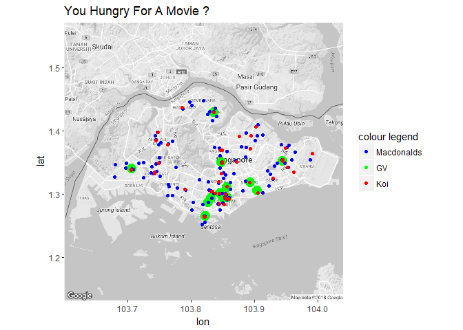

Plotting Cinema, Macdonalds and Tea locations
================

## Intro

Fun afternoon analysis I did to satisfy my curiosity. I wanted to find
which GV cinema had a Macdonalds or a Koi bubble tea store nearby.
Knowing which cinema to head to on a Sat/Sun afternoon is a an important
question. Especially if I get chicken nugget or milk tea cravings.

``` r
knitr::opts_chunk$set(echo = TRUE)
work_directory = getwd()

#specify the packages of interest
packages = c("tidyverse","ggmap","readxl","geosphere")

#use this function to check if each package is on the local machine
#if a package is installed, it will be loaded
#if any are not, the missing package(s) will be installed and loaded
package.check <- lapply(packages, FUN = function(x) {
    if (!require(x, character.only = TRUE)) {
        install.packages(x, dependencies = TRUE, repos = 'http://cran.us.r-project.org')
        library(x, character.only = TRUE)
    }
})
```

## Reading in Data

Data was taken from

<https://www.gv.com.sg/GVCinemas>

<https://www.mcdonalds.com.sg/locate-us/>

<https://www.koithe.com/en/global/koi-singapore>

I did a bit of cleaning in word since I copy-pasted the data directly
from the websites which turned out to be a bit more trouble than
expected. I would have used a web scraper but I had no idea (and did not
want to deal with) the legal implications, so I stuck to the safer
method.

In any case everything was put into a nice excel file

``` r
#excel_sheets(path = 'locations to plot.xlsx')

# reading data for macdonalds locations
basedata_mac = read_excel('locations to plot.xlsx', sheet = 'Macdonalds') %>% 
  mutate(postcode = str_extract(Address, '[sS]ingapore \\d{6}$')) %>% filter(!is.na(postcode))
# checking if any row doesnt have postcode in the standard format 
# test = basedata_mac[-grep('[sS]ingapore \\d{6}$',basedata_mac$postcode),]


# reading data for gv locations
basedata_gv = read_excel('locations to plot.xlsx', sheet = 'GV') %>%
  mutate(postcode = str_extract(Address, '[sS]ingapore \\d{6}$')) %>% filter(!is.na(postcode))
  

# reading data for koi locations
basedata_koi = read_excel('locations to plot.xlsx', sheet = 'Koi') %>%
  mutate(postcode = str_extract(Address, '[sS]ingapore \\d{6}|[sS]\\(\\d{6}\\)'),
         postcode = str_replace(postcode, '[sS]\\((\\d{6})\\)', 'Singapore \\1')) %>% filter(!is.na(postcode))
# checking if any row doesnt have postcode in the standard format
#test = basedata_koi[-grep('[sS]ingapore \\d{6}$',basedata_koi$postcode),]


as.tibble(basedata_gv)
```

    ## # A tibble: 13 x 2
    ##    Address                                                   postcode     
    ##    <chr>                                                     <chr>        
    ##  1 SingPost Centre, 10 Eunos Road 8, #03-107, Singapore 408~ Singapore 40~
    ##  2 302 Tiong Bahru Road, #04-105, Tiong Bahru Plaza, Singap~ Singapore 16~
    ##  3 3 Temasek Boulevard #03-373 Suntec City Mall Singapore 0~ Singapore 03~
    ##  4 1 HarbourFront Walk, #02-30, VivoCity, Singapore 098585   Singapore 09~
    ##  5 68 Orchard Road, #07-01, Plaza Singapura, Singapore 2388~ Singapore 23~
    ##  6 4 Tampines Central, #04-17/18, Tampines Mall Shopping Ce~ Singapore 52~
    ##  7 1 Jurong West Central, #03-25B/26, Jurong Point, Singapo~ Singapore 64~
    ##  8 9 Bishan Place, #04-03, Junction 8 Shopping Centre, Sing~ Singapore 57~
    ##  9 180 Kitchener Road #05-02/03, Singapore 208539            Singapore 20~
    ## 10 1 Kim Seng Promenade, #03-29, Great World City, Singapor~ Singapore 23~
    ## 11 112 East Coast Road, #04-09, 112 Katong, Singapore 428802 Singapore 42~
    ## 12 51 Yishun Central 1, Singapore 768794                     Singapore 76~
    ## 13 Capitol Theatre, 17 Stamford Road, Singapore 178907       Singapore 17~

``` r
as.tibble(basedata_koi)
```

    ## # A tibble: 45 x 2
    ##    Address                                                    postcode    
    ##    <chr>                                                      <chr>       
    ##  1 Jurong East MRT 10 Jurong East Street 12, #01-09, Singapo~ Singapore 6~
    ##  2 Raffles City 252 North Bridge Road #B1-71,Singapore 17910~ Singapore 1~
    ##  3 HarbourFront Centre 1 Maritime Square #01-67A, Harbourfro~ Singapore 0~
    ##  4 Tampines Mall 4 Tampines Central 5 #02-K3B, Tampines Mall~ Singapore 5~
    ##  5 Novena Square 238 Thomson Road #01-61, Novena Square S(30~ Singapore 3~
    ##  6 Choa Chu Kang MRT 10 Choa Chu Kang Avenue 4 #01-04, Choa ~ Singapore 6~
    ##  7 Hillion Mall 17 Petir Road #B2-53, Hillion Mall S(678278)  Singapore 6~
    ##  8 Jurong Point 1 Jurong West Central 2 #02-41C, Jurong Poin~ Singapore 6~
    ##  9 The Arcade 11 Collyer Quay #01-12, The Arcade S(049317)    Singapore 0~
    ## 10 Woodlands MRT 30 Woodlands Avenue 2 #01-16, Woodlands MRT~ Singapore 7~
    ## # ... with 35 more rows

``` r
as.tibble(basedata_mac)
```

    ## # A tibble: 136 x 2
    ##    Address                                                     postcode   
    ##    <chr>                                                       <chr>      
    ##  1 McDonalds Keat Hong 818 Choa Chu Kang Avenue 1 #01-02 Sing~ Singapore ~
    ##  2 McDonald’s *SCAPE Park 2 Orchard Link #02-43 *SCAPE Singap~ Singapore ~
    ##  3 McDonald’s @ Resorts World Sentosa 8 Sentosa Gateway, #B1-~ Singapore ~
    ##  4 McDonald’s Admiralty 678A Woodlands Avenue 6 #01-05 Singap~ Singapore ~
    ##  5 McDonald’s Alocassia 383 Bukit Timah Road #01-09B Alocassi~ Singapore ~
    ##  6 McDonald’s Ang Mo Kio 51 Ang Mo Kio Avenue 3 #01-04 51 @ A~ Singapore ~
    ##  7 McDonald’s Ang Mo Kio 4 163 Ang Mo Kio Avenue 4 #01-438 Si~ Singapore ~
    ##  8 McDonald’s Ang Mo Kio Ave 10 448 Ang Mo Kio Avenue 10 #01-~ Singapore ~
    ##  9 McDonald’s Ang Mo Kio Park 10 Ang Mo Kio Street 12 Singapo~ Singapore ~
    ## 10 McDonald’s Balestier Shaw Plaza 360 Balestier Rd #01-10 Sh~ Singapore ~
    ## # ... with 126 more rows

## Getting the latitude and longitude for the addresses

I used geocode() from ggmap to get the latitudes and longitudes. I found
that using google as a source had a random over query limit error
despite not being at the limit so I had to rewrite the code to keep
trying until it got a result. Based on past experience using the Data
Science Toolkit source was not as accurate.

After getting the results I had to do some error corrections as 1 of the
outputs was incorrect.

I have already included a RData file with lat and lon data already run
beforehand

``` r
if (any(grepl('savedata.RData',list.files()))) {
  
  load('savedata.RData')
  
} else {
inputlist = list(macdonalds = basedata_mac, gv = basedata_gv, koi = basedata_koi) 

plotdata = map(inputlist, function(i) {

d = i$Address

out = map(d, function(i) {
  gcd = geocode(i, output = 'latlona', source = 'google')

  while (all(is.na(gcd))) {
    gcd = geocode(i, output = 'latlona', source = 'google')
  }
  data.frame(input_postcode = i, lon = gcd$lon, lat = gcd$lat)
  })

postcode_lonlat = reduce(out, rbind)    
data.frame(address = i$Address,postcode_lonlat)      
      
})

# making specific changes to correct errors
# note errors were identified in hindsight
error_1 = geocode(basedata_gv$postcode[5], output = 'latlona', source = 'google')
while (all(is.na(error_1))) {
    error_1 = geocode(basedata_gv$postcode[5], output = 'latlona', source = 'google')
  }
plotdata[['gv']][5,'lon'] = error_1$lon
plotdata[['gv']][5,'lat'] = error_1$lat

# saving data for future use 
save.image('savedata.RData')
}

str(plotdata)
```

    ## List of 3
    ##  $ macdonalds:'data.frame':  136 obs. of  4 variables:
    ##   ..$ address       : Factor w/ 136 levels "McDonald’s *SCAPE Park 2 Orchard Link #02-43 *SCAPE Singapore 237978",..: 136 1 2 3 4 6 5 7 8 9 ...
    ##   ..$ input_postcode: Factor w/ 136 levels "McDonalds Keat Hong 818 Choa Chu Kang Avenue 1 #01-02 Singapore 680818",..: 1 2 3 4 5 6 7 8 9 10 ...
    ##   ..$ lon           : num [1:136] 104 104 104 104 104 ...
    ##   ..$ lat           : num [1:136] 1.38 1.3 1.26 1.44 1.32 ...
    ##  $ gv        :'data.frame':  13 obs. of  4 variables:
    ##   ..$ address       : Factor w/ 13 levels "1 HarbourFront Walk, #02-30, VivoCity, Singapore 098585",..: 13 7 6 1 10 8 2 11 5 3 ...
    ##   ..$ input_postcode: Factor w/ 13 levels "SingPost Centre, 10 Eunos Road 8, #03-107, Singapore 408600",..: 1 2 3 4 5 6 7 8 9 10 ...
    ##   ..$ lon           : num [1:13] 104 104 104 104 104 ...
    ##   ..$ lat           : num [1:13] 1.32 1.29 1.29 1.26 1.3 ...
    ##  $ koi       :'data.frame':  45 obs. of  4 variables:
    ##   ..$ address       : Factor w/ 45 levels " Bishan MRT 200 Bishan Road #01-05, Bishan MRT S(579827)",..: 27 35 22 38 33 17 23 28 39 44 ...
    ##   ..$ input_postcode: Factor w/ 45 levels "Jurong East MRT 10 Jurong East Street 12, #01-09, Singapore 609690",..: 1 2 3 4 5 6 7 8 9 10 ...
    ##   ..$ lon           : num [1:45] 104 104 104 104 104 ...
    ##   ..$ lat           : num [1:45] 1.33 1.29 1.26 1.35 1.32 ...

## Data Plots

Awesome. Looks like I am spoiled for choice almost all the GV locations
seem to have at least a Koi or a Macdonalds nearby.

``` r
if (any(grepl('map',ls())) == FALSE) {
map <- get_map(location = 'Singapore', zoom = 11, color = 'bw')

while (is.na(map)) {
    map <- get_map(location = 'Singapore', zoom = 11, color = 'bw')
  }
}

ggmap(map) + 
  geom_point(data = plotdata$gv, aes(x =lon, y=lat, colour = 'green', size = 0.1)) +
  geom_point(data = plotdata$macdonalds, aes(x =lon, y= lat, colour = 'blue')) +
  geom_point(data = plotdata$koi, aes(x =lon, y=lat, colour = 'red')) +
  scale_size_continuous(guide = 'none') +
  scale_colour_manual(name = 'colour legend', 
         values =c('blue'='blue','green'='green', 'red'='red'), labels = c('Macdonalds','GV','Koi')) +
  labs( title = 'You Hungry For A Movie ?')
```

<!-- -->

## Distance Analysis

Taking it a little further I looked at which cinema locations offered
the closest Koi or Macdonalds. I used the haversine formula to calculate as the crow flies distance for a decent comparative guage. Finally since I
usually am more likely to get Koi cravings (about 75% of the time) than
I am Macdonalds and rarely have the 2 at the same time, I calculated my
expected walking distance in meters.

``` r
interim_data = map(plotdata, function(i){
  
  i %>% mutate(index = 'info') %>% select(-input_postcode)

})


gv_koi = interim_data[['gv']] %>% left_join(interim_data[['koi']], by = c('index')) %>% select(-index) %>%
  rowwise () %>% 
  mutate(distance = round(distHaversine(c(lon.x,lat.x),c(lon.y,lat.y)),2)) %>% group_by(address.x) %>%
  filter(distance == min(distance)) %>% ungroup() %>% 
  rename_at(vars(contains('.x')), funs(sub('.x', '_gv', .))) %>%
  rename_at(vars(contains('.y')), funs(sub('.y', '_koi', .))) %>%
  rename(distance_koi = distance) %>%
  select(address_gv, address_koi, distance_koi)


gv_mac = interim_data[['gv']] %>% left_join(interim_data[['macdonalds']], by = c('index')) %>% select(-index) %>%
  rowwise () %>% 
  mutate(distance = round(distHaversine(c(lon.x,lat.x),c(lon.y,lat.y)),2)) %>% group_by(address.x) %>%
  filter(distance == min(distance)) %>% ungroup() %>% 
  rename_at(vars(contains('.x')), funs(sub('.x', '_gv', .))) %>%
  rename_at(vars(contains('.y')), funs(sub('.y', '_mac', .))) %>%
  rename(distance_mac = distance) %>%
  select(address_gv, address_mac, distance_mac)


output = gv_koi %>% left_join(gv_mac, by = c('address_gv')) %>%
  select(address_gv, distance_koi, distance_mac) %>%
  mutate(expected_walking_distance = distance_koi*.75 + distance_mac*.25) %>%
  arrange(expected_walking_distance)

as.tibble(output)
```

    ## # A tibble: 13 x 4
    ##    address_gv                 distance_koi distance_mac expected_walking_~
    ##    <fct>                             <dbl>        <dbl>              <dbl>
    ##  1 180 Kitchener Road #05-02~        14.4         37.7                20.2
    ##  2 4 Tampines Central, #04-1~        10.4         50.0                20.3
    ##  3 51 Yishun Central 1, Sing~         4.05        88.7                25.2
    ##  4 9 Bishan Place, #04-03, J~       110.           6.15               83.9
    ##  5 68 Orchard Road, #07-01, ~        79.8        122.                 90.4
    ##  6 SingPost Centre, 10 Eunos~        98.0        108.                101. 
    ##  7 1 Jurong West Central, #0~       145.          68.5               126. 
    ##  8 1 HarbourFront Walk, #02-~       113.         204.                136. 
    ##  9 Capitol Theatre, 17 Stamf~       235.         225.                232. 
    ## 10 3 Temasek Boulevard #03-3~       251.         250.                251. 
    ## 11 112 East Coast Road, #04-~       305.         391.                326. 
    ## 12 1 Kim Seng Promenade, #03~      1108.          52.6               844. 
    ## 13 302 Tiong Bahru Road, #04~      1989.          33.3              1500.

## Conclusion

Yup and the results confirm my suspicious. The GV Tampines Mall offers
one of the best trade offs. But there are also other good options such
as Yishun Central and City Square Mall. I live in the East side of
Singapore, so Tampines Mall is the natural choice.
